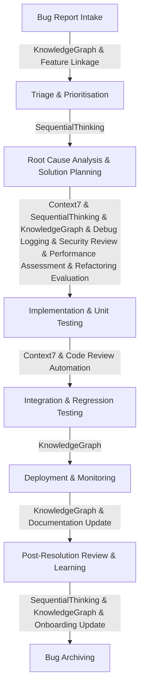

# Bug Fixing Workflow

**Objective:** To establish a clear, repeatable process for efficiently identifying, triaging, and resolving bugs, ensuring software quality and user satisfaction across all projects, enhanced by MCP tools for structured analysis, knowledge retrieval, and relationship tracking, and integrated with other development workflows.

## Workflow Stages

### 1. Bug Report Intake
- **Purpose:** Capture detailed information about a reported bug and link it to relevant project context.
- **Steps:**
  1. Receive bug reports from users, automated monitoring systems, or internal testing.
  2. Document the bug with a clear title, detailed description, steps to reproduce, expected behaviour, and actual behaviour.
  3. Include environment details (OS, browser, app version) and any relevant screenshots or logs.
  4. Assign a unique identifier to the bug report.
  5. **Check if the reported bug relates to a recent feature or enhancement documented in the Feature Request Workflow. If so, link the bug report to the relevant feature entity.**

- **MCP Tool Enhancement:**
  - **KnowledgeGraph**: Use this tool to create entities for new bug reports, linking them to affected components, features (from Feature Request Workflow), or user personas for comprehensive tracking.
    - **Application**: Establish relationships between the bug, its impact, and the parts of the system it affects, including its origin from a specific feature.
  - **Filesystem**: Utilise this tool to create dedicated directories for each bug report and store associated artifacts like screenshots and log files.
    - **Application**: Use `create_directory` to organise bug-specific folders (e.g., `bugs/BUG-XXXX/`) and `write_file` to save diagnostic data.

- **Deliverable:** A comprehensive bug report in a centralised issue tracker, with initial relationships mapped in the KnowledgeGraph (including links to features), and artifacts organised in the file system.

### 2. Triage and Prioritisation
- **Purpose:** Evaluate the severity, impact, and urgency of the bug to determine its priority and assign ownership.
- **Steps:**
  1. Review the bug report for completeness and clarity.
  2. Assess the bug's severity (e.g., critical, major, minor, cosmetic) and impact on users or system functionality.
  3. Prioritise the bug based on severity, impact, frequency, and business goals.
  4. Assign the bug to the appropriate team or individual for resolution.

- **MCP Tool Enhancement:**
  - **SequentialThinking**: Leverage this tool to guide the triage process, breaking down the assessment into logical steps to ensure all factors (severity, impact, resources) are considered.
    - **Application**: Use SequentialThinking to form a hypothesis on the bug's priority and verify it through a structured thought process, leading to a well-reasoned decision.

- **Deliverable:** A triaged and prioritised bug report, assigned to a team/individual, with the rationale for prioritisation documented.

### 3. Root Cause Analysis and Solution Planning
- **Purpose:** Identify the underlying cause of the bug and plan the most effective solution, considering security, performance, and refactoring needs.
- **Steps:**
  1. Replicate the bug in a development or staging environment.
  2. Investigate the codebase, logs, and system behaviour to pinpoint the root cause.
  3. **Implement debug logging as per the Debug Logging Workflow, using the MCP Memory server to capture detailed logs and observations during investigation.**
  4. **Conduct a security review to assess if the bug has security implications (e.g., potential vulnerabilities). Use Context7 to fetch relevant security documentation and SequentialThinking to evaluate security risks, referencing the Security Practices Workflow.**
  5. **Assess if the bug indicates underlying performance issues. If so, reference the Performance Optimization Workflow to use profiling tools and establish performance baselines as needed, using SequentialThinking for structured analysis.**
  6. **Evaluate if the bug indicates underlying code duplication or structural issues requiring refactoring. If so, trigger an initial assessment per the Refactoring Analysis and Planning Workflow, and consider DRY principles (from Refactor DRY Principles Workflow) for reusable solutions.**
  7. Brainstorm potential solutions and evaluate their feasibility, impact, and effort.
  8. Define the scope of the fix and any necessary regression tests.

- **MCP Tool Enhancement:**
  - **Context7**: Utilise this tool to fetch up-to-date documentation for libraries, frameworks, or internal APIs relevant to the affected code, aiding in root cause identification and solution design, including security best practices.
    - **Application**: Retrieve specific documentation for functions or modules suspected of causing the bug, and for secure coding guidelines.
  - **SequentialThinking**: Apply this tool to structure the root cause analysis and solution planning, breaking down complex problems into manageable investigative steps, including security and performance assessments.
    - **Application**: Use SequentialThinking to explore different hypotheses for the root cause and evaluate various solution approaches, and to guide security and performance analysis.
  - **KnowledgeGraph**: Update the graph with findings from the root cause analysis, linking the bug to the specific code areas or design decisions that caused it, including security vulnerabilities, performance bottlenecks, or refactoring needs.
    - **Application**: Document the root cause and proposed solution as entities linked to the bug report for future reference, capturing all related issues.
  - **Filesystem**: Apply this tool to manage investigation artifacts, such as temporary log files or code snippets, and to organise test data.
    - **Application**: Use `write_file` to save temporary analysis results or `search_files` to locate relevant log files during investigation.

- **Deliverable:** A documented root cause (including security, performance, or refactoring implications), a detailed solution plan, updated KnowledgeGraph entries for the bug, and organised investigation artifacts.

### 4. Implementation and Unit Testing
- **Purpose:** Develop and implement the bug fix, ensuring it addresses the root cause without introducing new issues, and adheres to code quality standards.
- **Steps:**
  1. Implement the solution following coding standards and best practices.
  2. **Run automated static analysis and feedback generation as per the Code Review Automation Workflow to ensure code quality and adherence to standards.**
  3. Write or update unit tests to cover the fixed functionality and prevent regressions.
  4. Ensure the fix is isolated and does not have unintended side effects.

- **MCP Tool Enhancement:**
  - **Context7**: Continue to reference this tool for any additional documentation needed during coding, ensuring adherence to best practices for chosen technologies.
    - **Application**: Retrieve specific documentation for APIs or libraries as implementation questions arise.

- **Deliverable:** Implemented bug fix code, with comprehensive unit tests, validated by automated code review checks, ready for further testing.

### 5. Integration and Regression Testing
- **Purpose:** Verify that the bug fix integrates correctly with the rest of the system and does not introduce regressions.
- **Steps:**
  1. Integrate the fix into the main codebase or a dedicated testing branch.
  2. Conduct integration tests to ensure the fixed component works correctly with other system parts.
  3. Perform regression tests to confirm that existing functionalities are not negatively impacted by the fix.
  4. Conduct system tests to verify end-to-end functionality.

- **MCP Tool Enhancement:**
  - **KnowledgeGraph**: Record test cases executed and their results as entities linked to the bug fix, creating a historical record for future reference.
    - **Application**: Map out test coverage and outcomes to ensure the fix is thoroughly validated.

- **Deliverable:** A thoroughly tested bug fix, validated against integration and regression test suites, with test results documented in the KnowledgeGraph.

### 6. Deployment and Monitoring
- **Purpose:** Release the bug fix to the production environment and monitor its performance, and ensure proper documentation.
- **Steps:**
  1. Prepare release notes detailing the bug fix and its impact.
  2. Deploy the fix to the production environment following established deployment protocols.
  3. Monitor the system for any immediate issues or unexpected behaviour post-deployment.
  4. **Trigger the Documentation Update Workflow to draft release notes and update relevant user guides or technical documentation for the bug fix.**
  5. Communicate the resolution to affected users or stakeholders.

- **MCP Tool Enhancement:**
  - **KnowledgeGraph**: Update the graph with deployment details, linking to release notes and monitoring plans.
    - **Application**: Track deployment status and immediate post-deployment feedback for traceability.
  - **Filesystem**: Utilise this tool to manage the creation and update of documentation files related to the bug fix.
    - **Application**: Use `write_file` to create or update release notes and other documentation.

- **Deliverable:** Deployed bug fix, with updated knowledge graph entries, communication to stakeholders, and updated documentation.

### 7. Post-Resolution Review and Learning
- **Purpose:** Reflect on the bug fixing process to identify areas for improvement and capture lessons learned, and update onboarding materials.
- **Steps:**
  1. Conduct a post-mortem or review meeting for critical bugs to analyse the process and identify contributing factors.
  2. Document lessons learned, including preventative measures, process improvements, or new best practices.
  3. Update relevant project documentation or knowledge bases with these learnings.
  4. **Update onboarding materials or training documentation with insights from significant bug fixes, referencing the Onboarding and Training Workflow.**

- **MCP Tool Enhancement:**
  - **SequentialThinking**: Use this tool to analyse the bug fixing process, generating hypotheses on improvements and verifying them through reflective steps.
    - **Application**: Break down the post-mortem into actionable insights for process refinement.
  - **KnowledgeGraph**: Add lessons learned as entities linked to the bug report, maintaining a comprehensive view of problem-solving over time, including links to updated onboarding materials.
    - **Application**: Document the entire bug lifecycle, including the resolution and subsequent learnings, for ongoing reference and training.

- **Deliverable:** A post-resolution report with structured insights and an updated KnowledgeGraph for continuous improvement, and updated onboarding/training materials.

### 8. Bug Archiving
- **Purpose:** Archive resolved bug documentation and associated artifacts for historical reference and declutter active bug folders.
- **Steps:**
  1. Once a bug is fully resolved and post-resolution review is complete, Cline uses `Filesystem` to move the bug's dedicated directory (e.g., `bugs/BUG-XXXX/`) to an `archived_bugs/BUG-XXXX/` folder.
  2. Cline uses `KnowledgeGraph` to update the bug entity's location and status to "Archived," maintaining traceability.

- **MCP Tool Enhancement:**
  - **Filesystem**: Used to move the bug's documentation and artifacts to an archive folder.
    - **Application**: `move_directory` for reorganising bug data.
  - **KnowledgeGraph**: Used to update the bug's record with its new archived location and status.
    - **Application**: Update the entity's properties to reflect archiving.

- **Deliverable:** Archived bug documentation and updated KnowledgeGraph entries reflecting the archived status and location.

## Visual Representation

## Instructions for Cline

- **MUST** reference this workflow for any task involving bug identification, analysis, or resolution.
- **MUST** follow the stages outlined to ensure a consistent and thorough approach to bug fixing.
- **MUST** utilise the specified MCP tools (SequentialThinking, Context7, KnowledgeGraph, Filesystem) at the relevant stages to enhance the process with structured thinking, technical reference, relationship tracking, and automated file management. This includes explicitly applying these tools in Triage, Root Cause Analysis, Post-Resolution Review, and Bug Archiving stages to ensure comprehensive bug resolution and documentation management.
- **MUST** document the use of each MCP tool in the project logs or memory bank to track their application and impact on the bug fixing process.
- **SHOULD** adapt the specifics of each stage (e.g., issue tracking systems, testing environments) based on project context and user preferences, while ensuring that MCP tools are integrated as a core component of the workflow.
- **MUST** document progress through each stage in relevant project documentation or memory bank files for traceability, including updates to the KnowledgeGraph for relationship tracking.
- **SHOULD** handle situations where MCP tools might fail by reporting the failure to the user and suggesting manual intervention or alternative approaches.

## Change Log
- **Version 1.0, Date: 2025-06-20**
  - **Summary:** Initial creation of the global bug fixing workflow.
  - **Rationale:** To provide a standardised process for identifying, triaging, and resolving bugs across all projects, ensuring consistent software quality and user satisfaction.

- **Version 1.1, Date: 2025-06-20**
  - **Summary:** Added 'Bug Archiving' stage to move fixed bug documentation to a new folder.
  - **Rationale:** To improve documentation organisation and declutter active bug tracking folders, ensuring easier access to historical bug data.

- **Version 1.2, Date: 2025-06-22**
  - **Summary:** Enhanced the Bug Fixing Workflow with deeper integrations with Debug Logging, Code Review Automation, Security Practices, Documentation Update, Feature Request, Performance Optimization, Refactor DRY Principles, Refactoring Analysis and Planning, and Onboarding and Training Workflows.
  - **Rationale:** To create a more comprehensive and cohesive bug resolution system by leveraging existing workflows for structured analysis, quality assurance, and knowledge management, ensuring higher code quality, better documentation, and improved team learning.
