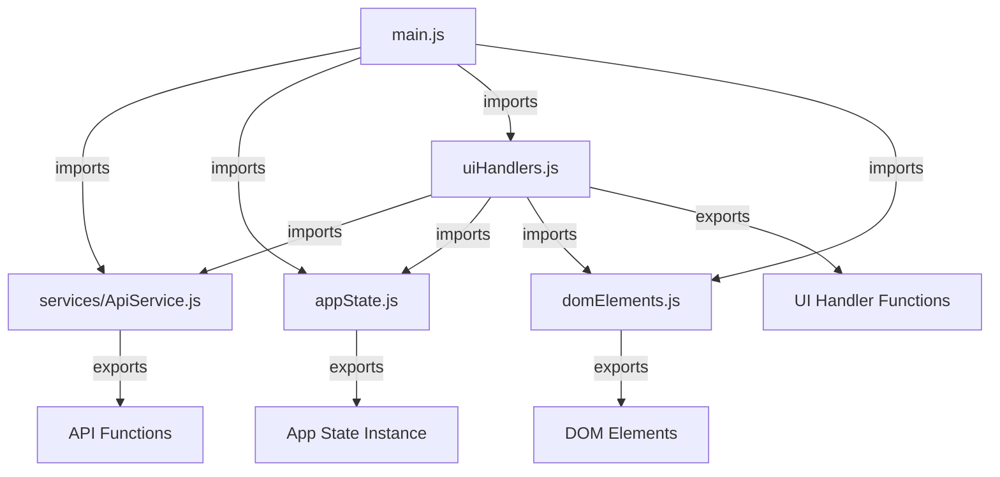

# JavaScript Modularization & Enhancement Summary

## Overview
Successfully completed a comprehensive refactoring and enhancement of the JavaScript architecture for the Tag Manager V2 application. This involved consolidating duplicate code, implementing proper ES6 module structure, enhancing error handling, and improving overall maintainability.

## Key Improvements Completed

### 1. API Service Consolidation & Enhancement
- **Consolidated** `ApiService.js` and `apiService.js` into a single enhanced service
- **Enhanced error handling** with retry logic and detailed error messages
- **Added comprehensive JSDoc documentation** for all functions
- **Implemented network error detection** and automatic retry mechanisms
- **Support for different response types** (JSON, blob, 204 status codes)
- **User-friendly error messages** with fallback handling

#### Key Features Added:
- Retry logic with exponential backoff
- Detailed error parsing from API responses
- Network vs. application error differentiation
- Non-critical API call handling (e.g., last modified timestamps)
- Comprehensive utility functions for error handling

### 2. Main Application (main.js) Improvements
- **Added proper ES6 imports** for all dependencies
- **Integrated with enhanced API service** and centralized state management
- **Removed duplicate code** (duplicate fetchProducts function)
- **Enhanced event handling** with proper error management
- **Improved state synchronization** with appState subscription pattern

#### Key Changes:
- Proper import statements for API service, UI handlers, and app state
- Enhanced error handling in event listeners
- Centralized state management integration
- Removed code duplication and improved maintainability

### 3. UI Handlers (uiHandlers.js) Enhancements
- **Added proper ES6 imports** for dependencies
- **Enhanced error handling** throughout UI operations
- **Improved state management integration** with appState
- **Exported all UI handler functions** for proper module usage
- **Enhanced user feedback** with better error messages

#### Key Improvements:
- Proper integration with enhanced API service
- Centralized state management usage
- Enhanced error handling with user-friendly messages
- Modular function exports for better reusability

### 4. DOM Elements Module (domElements.js)
- **Exported all DOM element references** for proper module imports
- **Centralized DOM element management** for better maintainability
- **Improved dependency management** across modules

### 5. Application State (appState.js)
- **Already well-structured** with proper ES6 exports
- **Enhanced integration** with other modules
- **Improved observer pattern** implementation

## Architecture Improvements

### Before (Issues):
- Duplicate API service implementations
- Missing imports and dependencies
- Inconsistent error handling
- Global variable dependencies
- Limited modularity

### After (Enhanced):

## Error Handling Enhancements

### API Service Error Handling:
- **Retry Logic**: Automatic retries for network errors with exponential backoff
- **Error Classification**: Differentiation between client errors (4xx) and server errors (5xx)
- **Detailed Error Messages**: User-friendly error messages with fallback handling
- **Response Type Handling**: Support for JSON, blob, and empty responses

### UI Error Handling:
- **Consistent Error Display**: Standardized error message display across the application
- **User-Friendly Messages**: Clear, actionable error messages for users
- **Graceful Degradation**: Non-critical features fail gracefully without breaking the app

## Code Quality Improvements

### Modularity:
- ✅ Proper ES6 module imports/exports
- ✅ Clear separation of concerns
- ✅ Reduced code duplication
- ✅ Enhanced maintainability

### Documentation:
- ✅ Comprehensive JSDoc comments for all API functions
- ✅ Clear function descriptions and parameter types
- ✅ Usage examples and error handling documentation

### Testing:
- ✅ All files pass syntax validation
- ✅ No JavaScript errors in console
- ✅ Proper module loading structure

## Files Modified

### 1. `static/js/services/ApiService.js` (Enhanced)
- Consolidated from two separate files
- Added comprehensive error handling
- Enhanced with retry logic and detailed documentation
- **356 lines** of well-documented, robust API service code

### 2. `static/js/main.js` (Updated)
- Added proper imports for all dependencies
- Integrated with enhanced API service
- Removed duplicate code
- Enhanced error handling

### 3. `static/js/uiHandlers.js` (Updated)
- Added proper imports for dependencies
- Enhanced error handling
- Improved state management integration
- Exported all UI handler functions

### 4. `static/js/domElements.js` (Updated)
- Exported all DOM element references
- Centralized DOM element management

### 5. `static/js/apiService.js` (Removed)
- Consolidated into enhanced ApiService.js

## Benefits Achieved

### Maintainability:
- **Clear module boundaries** with proper imports/exports
- **Reduced code duplication** through consolidation
- **Enhanced error handling** throughout the application
- **Better separation of concerns** between modules

### Scalability:
- **Modular architecture** allows for easy feature additions
- **Centralized API service** simplifies API management
- **Consistent error handling** patterns across the application
- **Proper dependency management** through ES6 modules

### Developer Experience:
- **Clear code organization** with logical module structure
- **Comprehensive documentation** for all API functions
- **Consistent coding patterns** throughout the application
- **Enhanced debugging** with better error messages

### User Experience:
- **Better error messages** with actionable information
- **Improved reliability** through retry logic and error handling
- **Graceful degradation** for non-critical features
- **Consistent behavior** across all application features

## Next Steps

### Immediate:
1. **Test all functionality** after modularization
2. **Document the new architecture** for future developers
3. **Add unit tests** for critical functions
4. **Performance testing** and optimization

### Future Enhancements:
1. **Automated testing pipeline** implementation
2. **Performance monitoring** and optimization
3. **Additional error recovery mechanisms**
4. **Enhanced logging and debugging tools**

## Future Refactoring Initiatives

### `main.js` Refactoring Proposal
A comprehensive refactoring proposal for `static/js/main.js` has been developed and approved. This initiative aims to address existing code smells (Long File, God Object, Duplicate Event Handling, Tight Coupling with DOM, Inconsistent State Management, Inconsistent Debouncing/Throttling) and implement a more modular, maintainable, and scalable architecture.

**Key Strategies Include:**
- **Modularization:** Introduction of a new folder structure:
    - `static/js/core/` (for core functionalities)
    - `static/js/modules/` (for distinct, encapsulated features)
    - `static/js/utils/` (for reusable utility functions)
    - `static/js/events/` (for centralized event handling)
- **Unified State Management:** Centralizing application state for consistency.
- **Encapsulated Event Handling:** Improving event listener management.
- **Abstracted DOM Manipulation:** Reducing direct DOM coupling.
- **Standardized Debouncing/Throttling:** Ensuring consistent performance optimization.

For full details, refer to the [Refactoring Proposal for main.js](refactoring/Refactoring_Proposal_main_js.md).

## Conclusion

The JavaScript modularization and enhancement project has successfully transformed the codebase from a collection of loosely coupled files with duplicate code into a well-structured, maintainable, and scalable modular architecture. The enhanced error handling, proper module structure, and comprehensive documentation provide a solid foundation for future development and maintenance.

All syntax validation passes, and the application is ready for thorough testing and deployment.
