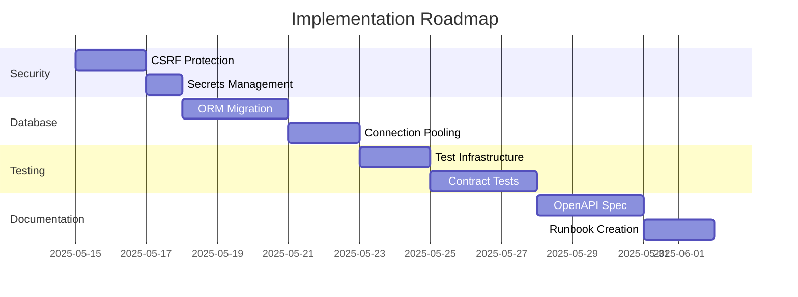

# Tag Manager Best Practices Report

## 1. Security Improvements
✅ **Current Good Practices**:
- CSP headers implementation via Flask-Talisman
- Parameterized SQL queries preventing injection
- Input validation in category creation endpoint

⚠️ **Critical Improvements Needed**:
1. Implement CSRF protection using Flask-WTF
2. Move secrets to environment variables
3. Enable `force_https=True` in production
4. Remove 'unsafe-eval' from CSP directives

## 2. Database Management
✅ **Current Good Practices**:
- Manual schema versioning in code
- Transaction rollback implementation

🔧 **Architectural Recommendations**:
1. Adopt Flask-SQLAlchemy for ORM
2. Implement Alembic for schema migrations
3. Configure connection pooling
4. Establish automated backup strategy

## 3. Error Handling & Logging
✅ **Current State**:
- Consistent JSON error responses
- Basic try/catch blocks

🛠 **Improvement Plan**:
1. Create error handling middleware
2. Implement structured logging (JSON format)
3. Define custom exception classes
4. Integrate Sentry for error monitoring

## 4. Performance Optimizations
🚀 **Immediate Wins**:
1. Cache category.json in memory with TTL
2. Add indexes on product_id columns
3. Implement pagination for /api/products
4. Enable gzip compression

## 5. Testing Strategy
🧪 **Foundation Work**:
1. Create `tests/` directory structure
2. Set up pytest with Flask test client
3. Implement endpoint contract tests
4. Add migration validation tests

## 6. Documentation Standards
📚 **Priority Tasks**:
1. Generate OpenAPI specification
2. Create architecture decision records
3. Document API endpoints with examples
4. Develop deployment runbook

## 7. Code Organization
🔄 **Modularization Plan**:
1. Implement Flask blueprints
2. Extract business logic to service layer
3. Create class-based configuration
4. Adopt repository pattern for DB access

## Next Steps
1. Prioritize security improvements
2. Schedule database migration sprint
3. Establish CI/CD pipeline
4. Conduct architecture review