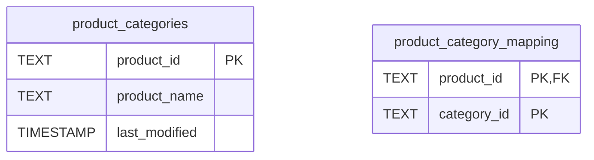

# Tag Manager Project Outline

## Project Overview
(No significant changes needed)

## Problem Statement
(No changes needed)

## Core Features
- Add "Category Hierarchy Management" to existing list
- Update "Data Persistence" to mention SQLite database

## Technical Architecture

### Backend Architecture
Updated structure:
1. **Database Layer**: SQLite with schema migration support
2. **Data Access**: SQLite connection management
3. **Security**: Flask-Talisman with CSP policies
4. **API Layer**: Enhanced error handling and transactions
5. **Service Layer**: Category hierarchy management

### Frontend Architecture
- Add "Tailwind CSS integration"
- Update styling approach documentation

### Data Flow
1. **Initialization**:
   - Database schema verification/migration
   - CSV import only during first setup

2. **Operations**:
   - All data access through SQLite
   - Category changes propagate through hierarchy

## Data Structure

### Database Schema

### File Storage
- category.json remains for hierarchy definitions
- CSV only used for initial data import

## Current Status
- ✅ Database integration completed (SQLite)
- ✅ Security headers implemented
- ✅ Category hierarchy support (3 levels)
- ✅ Transactional data operations
- ◻️ Automated schema migrations

## Technical Constraints
- ~~Data persistence limited to CSV files~~
- Production security settings not enabled (force_https=False)
- No database connection pooling
- Manual category.json management

## Dependencies
Added:
- SQLite
- Flask-Talisman
- sqlite3

Changed:
- Pandas (optional, only for CSV import)

## Future Improvements
Remove completed items and add:
- Database connection pooling
- Automated schema migrations
- Category JSON → Database migration
- Production security configuration