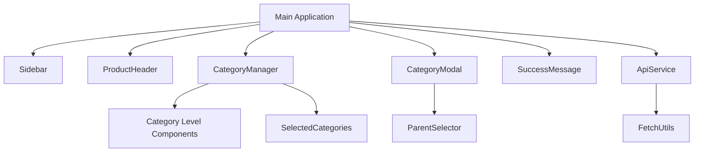

# Frontend Modularization Strategy

## Component Breakdown

### Core Components
1. **Sidebar Component**
   - Navigation links
   - Product selection dropdown
   - Hide allocated toggle
   - Export CSV button

2. **Product Header Component**
   - Displays selected product name
   - Shows product handle

3. **Category Management Component**
   - Current categories display
   - Add category button
   - Category selection grid (L1-L3)
   - Selected categories summary

4. **Category Creation Modal**
   - Category name input
   - Level selection
   - Parent category dropdown
   - Creation form

5. **Success Message Component**
   - Temporary notification
   - Animated entry/exit

### Dependency Mapping


## File Structure

```
templates/
  components/
    sidebar.html
    product_header.html
    category_management.html
    category_creation_modal.html
    success_message.html
  base.html
  index.html

static/
  js/
    components/
      ProductSelector.js
      CategoryManager.js
      CategoryLevel.js
      CategoryModal.js
      SuccessNotifier.js
    services/
      ApiService.js
      EventBus.js
    utils/
      dom.js
      formatters.js
    app.js
```

## Template Inheritance

`base.html` structure:
```html
<!DOCTYPE html>
<html lang="en">
<head>
  <!-- Common meta tags, title, CSS links -->
</head>
<body>
  
  <script src="/static/js/app.js" type="module"></script>
</body>
</html>
```

`index.html`:
```html



  
  <main>
    
    
  </main>
  
  

```

## Versioning Strategy

### Phased Migration
1. **v1 (Current)**: Monolithic implementation
2. **v2 (New)**: Modular component-based architecture
3. **Migration Path**:
   - Implement v2 alongside v1
   - Add version toggle in settings
   - Gradually migrate users
   - Full deprecation of v1 after 30 days

### Backward Compatibility
- Maintain identical API endpoints
- Preserve CSS class names
- Use same DOM element IDs
- Provide migration script for user preferences

## Implementation Phases

### Phase 1: Foundation
1. Create base.html template
2. Extract core components
3. Setup JS module structure

### Phase 2: Component Implementation
1. Build sidebar component
2. Create category management module
3. Implement modal system

### Phase 3: Integration
1. Connect components via event bus
2. Implement API service
3. Add error handling

### Phase 4: Testing & Migration
1. Cross-browser testing
2. Performance benchmarking
3. Gradual user migration
4. Final deprecation of monolithic version
